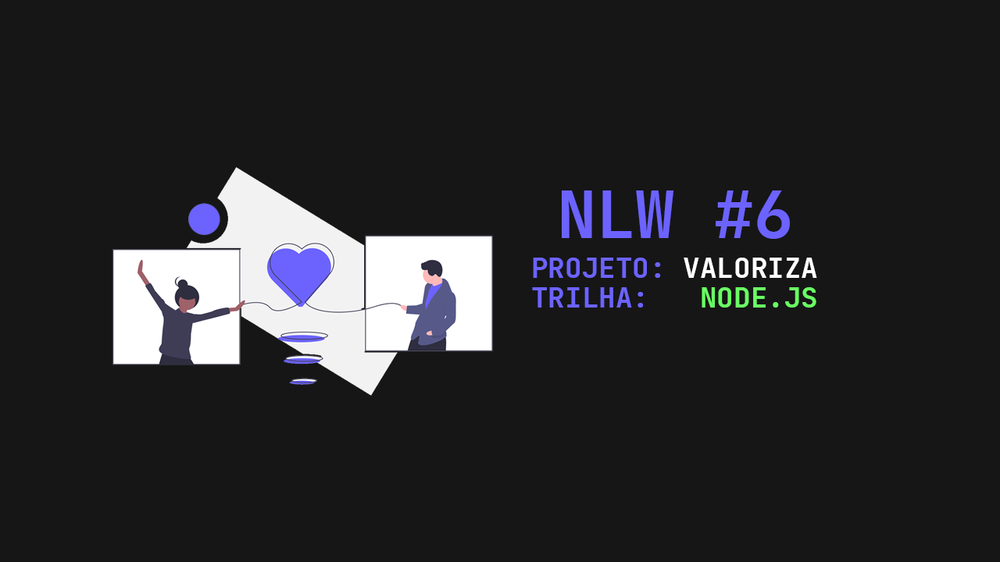

# NLW #6 - Valoriza

<br><br>

<p align="center">
  
</p>

<br><br>

# Sobre o projeto

<div align="center">

 


</div>


O projeto trata-se de uma plataforma de envio de elogios, que tem como finalidade demonstrar o agradecimento de uma pessoa à outra.

**⚛️ Tecnologias Utilizadas:**

- [Node.JS](https://nodejs.org/)
- [Typescript](https://www.typescriptlang.org)

**➕ Dependências**:

- [Express](expressjs.com)
- [JsonWebToken](https://jwt.io)
- [TypeORM](https://typeorm.io)
- [uuid](https://github.com/uuidjs/uuid)
- [Class Transformer](https://github.com/typestack/class-transformer)
- [Bcrypt](https://github.com/kelektiv/node.bcrypt.js/)
<br><br>

# Instalação do Projeto:

**1 - Clonar com HTTPS:**
<br>

```
mkdir nlw-valoriza
cd nlw-valoriza
git init
git clone https://github.com/henriquefontes/nlwvaloriza.git
```
<br>

**2 - Instalando dependências:**
- Usando o Yarn

```
yarn install
```
- Usando o NPM

```
npm install
```
<br>

**3 - Iniciando o projeto:**

- Usando o Yarn

```
yarn dev
```
- Usando o NPM

```
npm run dev
```
<br>

